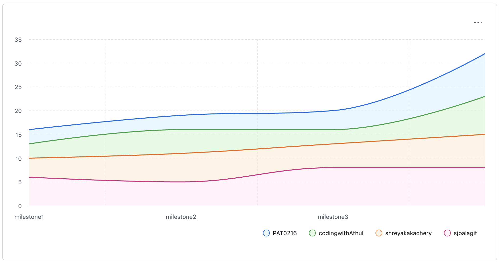
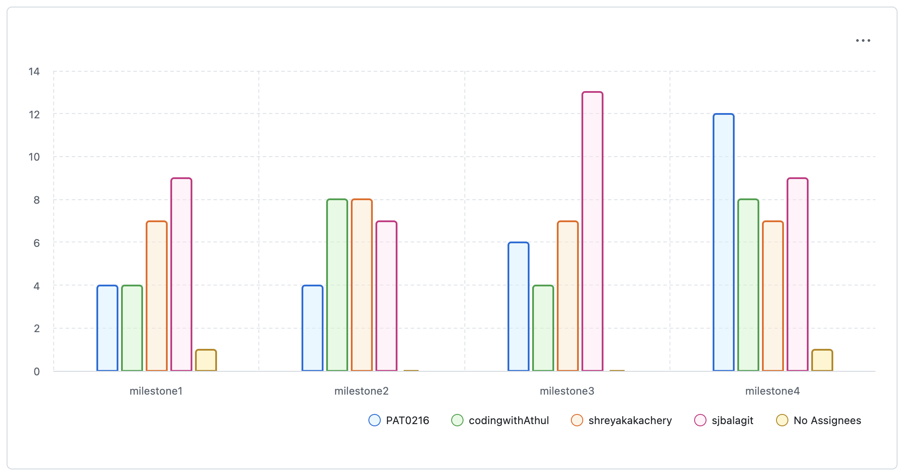

### Overview

This retrospective reflects on the team’s work organization, collaboration practices, and use of tooling across all Milestones. We use GitHub Project views and issue metadata to ground the discussion in observable data, and we apply the DAKI (Drop, Add, Keep, Improve) framework to identify concrete actions for future projects.

#### **Completion Rate Across Milestones**

The burn-up chart below shows cumulative task completion over time, helping visualize our pace and how work accumulated across milestones.

{#fig-burnup width=80%}

#### **Velocity Across Milestones**

Using the [Milestone Progress](https://github.com/orgs/UBC-MDS/projects/322/views/12) we observed that Milestones 1 and 2 progressed at a relatively steady pace, while Milestone 3 experienced a surge in task completions near the deadline. This indicates that while overall work was completed on time, review and integration efforts accumulated toward the end of the milestone.

#### **Team Contributions**

Looking at issue counts across Milestones 1–3, we see that work was largely distributed across the team, though some variation existed due to task complexity and team availability:

{#fig-team-cont width=80%}

Most team members contributed meaningfully across milestones. Some variation in task counts reflects differences in task complexity (e.g., larger coding tasks vs smaller documentation or bug fix tasks). Some minor fixes were sometimes bundled together into a single task, which slightly affects the task counts but does not significantly impact overall workload distribution. The "No Assignees" category comes from leftover Dependabot PRs.

During Milestone 3, we faced some availability challenges within the team. This led to a slightly higher workload for certain members, including taking on additional tasks to ensure progress continued smoothly. For example, some extra work included addressing unforeseen issues and helping integrate teammates’ fixes.

### Retrospective Discussions

DAKI (Drop, Add, Keep, Improve) Overview

**Drop:**

1. Open PRs till late in the milestone, leaving insufficient time for review and fixes.

**Add:**

1. Follow a specific format for commit messages (e.g. [Conventional Commits](https://www.conventionalcommits.org/en/v1.0.0/))
2. Issue templates for documentation, tasks, features etc.
3. PR review checklist.

**Keep:**

1. Using rules to keep main protected from unreviewed merges.
2. Using GitFlow main <- dev <- feature branches.
3. Regular commits with meaningful messages.
4. Using milestones to group work based on phase.

**Improve:**

1. Using issues more for project related discussions.
2. Creating complete issues and PRs - properly tagged with milestone, project, type, assignee, etc.
3. Set clear ownership for PRs after opening, so the author remains responsible for addressing review feedback before merging.
4. Communication on workload: break down of workload early on and communicating with the team if work needs to be redistributed.
5. Set clear rules on PR quality to ensure less time is spent on reviews.

#### **Development Tools, Infrastructure, and Scaling Up**

Throughout the project, we applied several development tools and infrastructure practices learned in this course, including GitHub Actions for CI/CD, branch protection rules, versioning, and automated documentation builds.

If this project were to scale up or transition into a longer-term open-source or production setting, we would further formalize these practices by:

1. Expanding CI test matrices across operating systems and Python versions.
2. Enforcing coverage thresholds using tools like Codecov.
3. Adding codeowners and stricter review requirements.
4. Formalizing contribution guidelines in CONTRIBUTING.md to support external contributors.
5. Holding regular meetings or check-ins to improve coordination and identify issues early on.
6. Enforcing the consistent use of conventions (e.g., commit message standards, PR templates, and issue templates) to improve communication and reduce review overhead.
7. Enforcing correct issue status tracking in the project board to ensure accurate representation of work progress.

#### **Planning Accuracy**

Looking at our [Milestone Progress](https://github.com/orgs/UBC-MDS/projects/322/views/12) view on the project board, we found that Milestones 1 and 2 had a similar number of tasks (22 and 21, respectively). However, Milestone 2 involved a heavier workload per task, and Milestone 3 contained more tasks overall (24) than initially anticipated, particularly for coding and integration work. Milestone 3 was underestimated due to unforeseen changes, such as handling edge cases like the degree symbol and coordinating fixes from teammates.

#### **Bottlenecks**

When reviewing the [Team Workload](https://github.com/orgs/UBC-MDS/projects/322/views/13) view on the project board and issue timelines, we identified several process related bottlenecks. In some cases, we did not consistently update task statuses to “In Progress,” which reduced visibility into active work and made it harder to identify capacity constraints early.

We also observed that several tasks spent time in the “Review” stage, as pull request reviews and follow up fixes required multiple iterations. Although we completed all required work before the milestone deadline, many tasks were closed close to the due date, indicating that review and integration work tended to accumulate toward the end of milestones.

#### **Bus Factor**

The project maintained shared responsibility across team members for most tasks, reducing our dependency on any single contributor.

In the [Team Workload](https://github.com/orgs/UBC-MDS/projects/322/views/13) view we can see that sjbalagit has the highest number of tasks. If they had been unavailable (e.g., sick), we would have faced delays. However in such a scenario, we could hold team meetings to redistribute tasks so that others could pick up the work.

